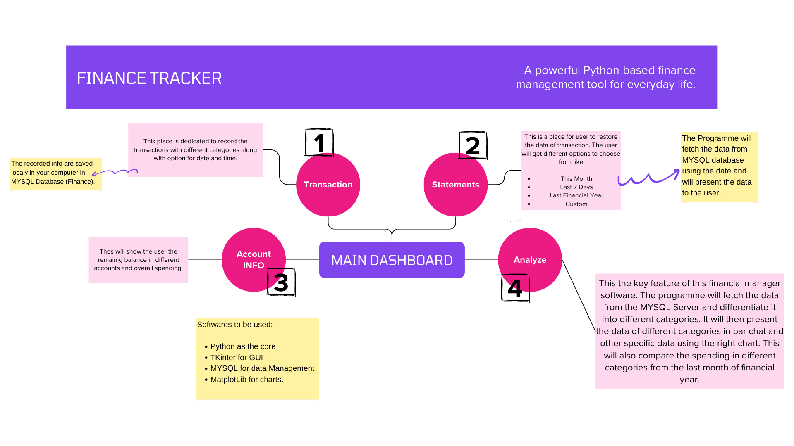

<h1># Finance-Tracker</h1>

A powerful Python-based finance management tool for everyday life.

<h2>Description</h2>

The Finance-Tracker project empowers you to take control of your personal finances with a user-friendly GUI built using Tkinter. Store and manage your daily transactions seamlessly, gain valuable insights into your spending habits through insightful data analysis, and visualize key trends with comprehensive chart formats.

<h2>Key Features</h2>

Intuitive GUI: Leverage the familiar Tkinter library for a straightforward and efficient user interface.
Streamlined Transaction Management: Effortlessly record your income and expenses, categorizing them for clear organization.
Data Analysis Powerhouse: Uncover valuable patterns in your spending with robust data analysis techniques.
Informative Charts: Gain visual clarity on your financial health with a variety of customizable chart types.
MySQL Integration: (Optional) For larger-scale financial tracking needs, integrate with MySQL for secure and scalable data storage.
Getting Started

<h2>Prerequisites: </h2>

Ensure you have Python 3 and the Tkinter library installed on your system. You can typically install Tkinter using pip install tkinter. Consider using a virtual environment for project isolation.
Clone the Repository: Use git clone https://github.com/Aadityakharkia/Finance-Tracker.git to download the project's code.
Run the Application: Navigate to the project directory and execute python main.py (or the appropriate script name) to launch the Finance-Tracker.

 
 

